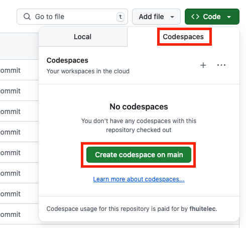

# FizzBuzz kata

For exercise instructions, check out the [requirements](./docs/requirements.md).

## Setup

### GitHub Codespace

> [!important]
> This is the setup we suggest you use.

Using [GitHub Codespaces](https://docs.github.com/en/codespaces/about-codespaces/what-are-codespaces):

1. go to [fhuitelec/fizzbuzz-kata](https://github.com/fhuitelec/fizzbuzz-kata)
2. click on **Code** > **Codespaces** > **Create codespace on main**
3. let it open in Visual Studio Code or use the web version



### Devcontainer

You need [nodejs](https://nodejs.org/en/download) & [npm](https://docs.npmjs.com/downloading-and-installing-node-js-and-npm) installed locally.

1. Install the [Dev Containers CLI](https://github.com/devcontainers/cli?tab=readme-ov-file#npm-install) with `npm install -g @devcontainers/cli`
2. Install the [Dev Containers](https://marketplace.visualstudio.com/items?itemName=ms-vscode-remote.remote-containers) VS Code extension
3. Open VS Code [command palette](https://docs.github.com/en/codespaces/reference/using-the-vs-code-command-palette-in-codespaces)
4. Type **Dev Containers: Reopen in Container** and hit **Enter**

## Getting started

```shell
# Run the FizzBuzz CLI
make run

# Run the unit tests
make test

# Run linting tools
make lint
```

## Save your work

> [!warning]
> When playing with GitHub Codespace, your git state is ephemeral and tied to the Codespace lifecycle: deleting the codespace will make you lose your changes.

To overcome this and keep a trace of the kata:

1. Either fork [fhuitelec/fizzbuzz-kata](https://github.com/fhuitelec/fizzbuzz-kata) or create an empty repository
2. In the codespace, run `git remote set-url origin git@github.com:USER/REPO.git`
   1. change `USER` & `REPO` with your own values
3. Push your changes to the new `origin`
